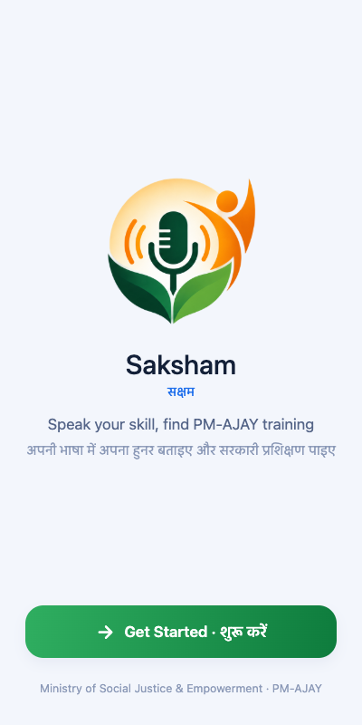
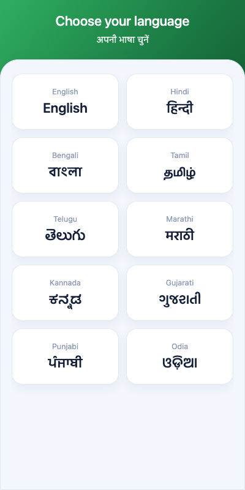
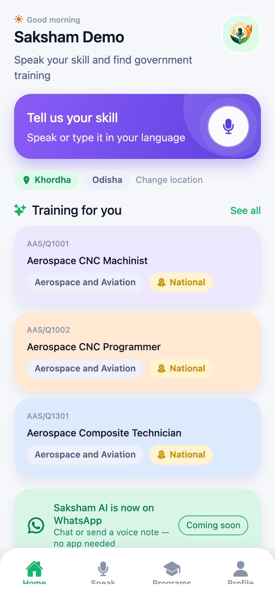
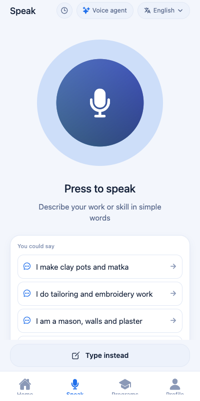
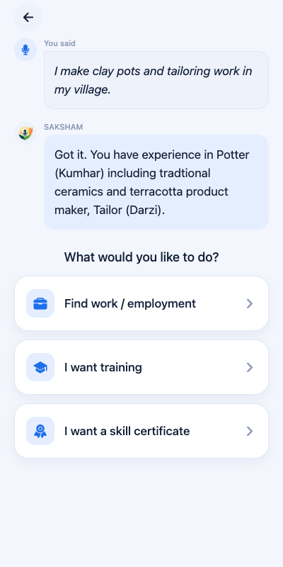
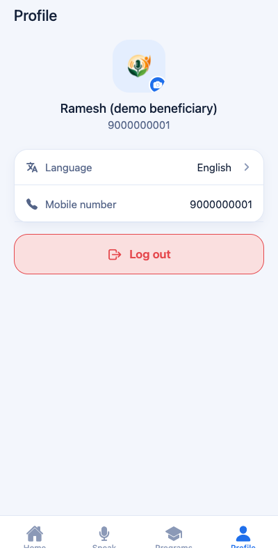
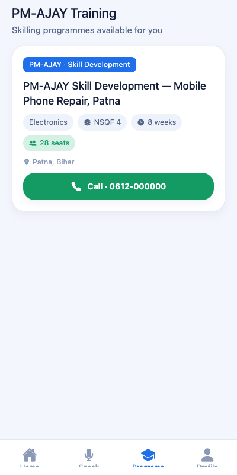
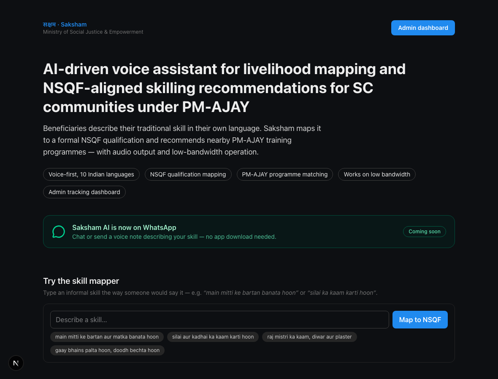

<div align="center">


# सक्षम · Saksham


**AI-Driven Voice Assistant for Livelihood Mapping and NSQF-Aligned Skilling
Recommendations for SC Communities under PM-AJAY**
Ministry of Social Justice & Empowerment · Government of India

[](server/package.json)
[](server)
[](server/prisma/schema.prisma)
[](server/prisma/schema.prisma)
[](app)
[](website)
[](tsconfig.json)
[](https://saksham-api-82mn.onrender.com/health)

A beneficiary describes their traditional skill, out loud, in their own
language. Saksham maps that informal description to a formal **NSQF
qualification**, recommends the **PM-AJAY courses** that qualification opens
up, and answers policy questions — all voice-first, low-bandwidth, and
grounded in real government data, not fabricated placeholders.

</div>

---

## Screenshots

<table>
<tr>
<td><br/><sub>Welcome</sub></td>
<td><br/><sub>10 languages</sub></td>
<td><br/><sub>Home dashboard</sub></td>
<td><br/><sub>Voice agent</sub></td>
</tr>
<tr>
<td><br/><sub>Skill confirmation</sub></td>
<td><br/><sub>Profile + photo</sub></td>
<td><br/><sub>Browse the catalogues</sub></td>
<td><br/><sub>Public website</sub></td>
</tr>
</table>

---

## Live

| | |
|---|---|
| **Backend API** | [`saksham-api-82mn.onrender.com`](https://saksham-api-82mn.onrender.com/health) — Render, Ohio region (co-located with the Neon DB) |
| **Android APK** | Built locally via `expo prebuild` + Gradle — see [Building the Android app](#building-the-android-app) |
| **Frontend / Admin dashboard** | [`saksham-website-five.vercel.app`](https://saksham-website-five.vercel.app/) — Vercel deployment |
| **Website / App (local)** | Run locally (`npm run dev`) — see [Run](#run) |

---

## What actually works

- **Voice-first in all 10 languages** — Hindi, English, Bengali, Tamil,
  Telugu, Marathi, Kannada, Gujarati, Punjabi, Odia. Every UI string, every
  screen, is natively translated (not machine-translated placeholders) —
  zero fallback to another language anywhere in the app.
- **Real speech, both directions** — [Sarvam AI](https://sarvam.ai) is the
  primary STT engine (`saaras:v3`, purpose-built for Indian languages), with
  automatic fallback to Groq's hosted Whisper, and Sarvam `bulbul:v3` speaks
  every reply back. Both degrade gracefully: on-device TTS and a deterministic
  offline mock, so the whole pipeline still runs with zero API keys.
- **A voice interview instead of forms** — after sign-in (or "continue without
  an account") the beneficiary is *asked* their name, age and education out
  loud, in their language, and an LLM turns each spoken answer into a
  structured value. Spoken Hindi number-words resolve correctly ("paccis" →
  25). Signing in with a name skips that question. Guests are profiled too —
  held in memory for the session only, never written to the server.
- **Replies that arrive with the voice** — the agent's answer types itself out
  word-by-word in step with the audio actually playing, and the mic stops
  listening on its own once you finish speaking. No second tap, no wall of
  text landing before the sentence is spoken.
- **A transparent, auditable skill-mapping engine** — an editable keyword
  lexicon (not a black-box model) maps informal phrases ("mitti ke bartan
  banata hoon") to a normalized skill, then to a real NSQF qualification.
  Every confidence score is a simple, inspectable formula.
- **Recommendations out of the real catalogue** — a matched qualification is
  scored against all 2,366 real PM-AJAY courses, and each card carries the QP
  code it came from, so any recommendation can be traced back to its
  government source. When the user's location is known, courses scoped to their
  state are shown before national or other-state options.
- **Only qualifications that are still valid** — every one of the 1,283 NSQF
  detail pages was scraped, and **464 of them (36%) turned out to be past their
  `Valid Till` date**. Expired qualifications are excluded from skill mapping
  and hidden from the catalogue, so nobody is routed to a dead qualification.
- **Real entry requirements** — each qualification's eligibility table (minimum
  education, field, required experience, prior training) is captured, along
  with the job titles it leads to, its progression pathway, the full NOS
  syllabus, and the theory/practical hour split.
- **Browse both catalogues** — search and filter all 1,283 NSQF qualifications
  and 2,366 PM-AJAY courses by sector, level and free text, five rows a page.
  PM-AJAY course browsing uses the saved device location to place state-near
  results first where the catalogue exposes location scope.
- **RAG for policy questions** — "will I get a certificate?", "how do I
  apply?" aren't in any database row; they're answered by retrieving real
  passages from government PDFs and having an LLM compose an answer
  *strictly* from those passages — never a guess, never outside knowledge.
- **A dynamic, voice-reactive UI** — the mic button is a continuously
  swirling gradient orb whose pulse visibly reacts to the beneficiary's
  actual speaking volume in real time, not a canned animation.
- **Conversation history** — the last 3 conversations are resumable from the
  Speak screen.
- **WhatsApp channel** — a Twilio webhook wired to the same real pipeline
  (text or voice notes), ready the moment Twilio credentials are added.
- **Admin dashboard** — session funnel, language/skill breakdowns, geo
  distribution, all backed by the same real data every beneficiary session
  produces.
- **Auth**: phone/password login, OTP-based forgot-password, profile photo
  upload (take/choose/remove).

### Being honest about what's still illustrative

Not everything in the database is real — and this project says so, loudly,
in the same places the data lives:

| Real, scraped, traceable | Illustrative sample data |
|---|---|
| 1,283 NSQF qualifications with their **complete detail pages** — job description, eligibility, occupations, progression pathway, NOS syllabus, validity dates ([nqr.gov.in](https://www.nqr.gov.in)) | The 12 `TrainingProgram` rows — their seats, contact numbers and batch dates are invented, because no government source publishes scheduled-batch data centrally (that lives with state/district implementing agencies) |
| 2,366 PM-AJAY-eligible courses ([pmajay.dosje.gov.in](https://pmajay.dosje.gov.in)) | |
| 177 RAG passages from 2 real government PDFs (PM-AJAY guidelines, NSQF gazette notification) | |

**What the voice agent recommends is entirely from the real columns.** The
illustrative `TrainingProgram` rows are labelled as their own tab in the browse
screen and managed from the admin dashboard; they are not what a beneficiary is
routed to. See `server/prisma/data/README*.md` for exact provenance of every
dataset, and the note above `model TrainingProgram` in
[`schema.prisma`](server/prisma/schema.prisma).

---

## Monorepo layout

| Folder | Stack | What it is |
|---|---|---|
| [`server/`](server) | Express + TypeScript + Prisma + PostgreSQL (Neon) | The one backend. Skill mapping, recommendation scoring, RAG, auth, admin API. **App and website talk only to this — no other DB client anywhere.** |
| [`app/`](app) | Expo SDK 57 (React Native) + Expo Router | The voice-first assistant beneficiaries actually use. |
| [`website/`](website) | Next.js 15 (App Router) + Tailwind v4 | Public info page + live skill-mapper demo + admin dashboard. |

```
                    ┌─────────────┐         ┌──────────────┐
                    │   app/      │         │  website/    │
                    │ Expo RN     │         │  Next.js 15  │
                    └──────┬──────┘         └───────┬──────┘
                           │      HTTP / JSON        │
                           └────────────┬────────────┘
                                  ┌──────▼───────┐        ┌─────────────┐
                                  │   server/    │◄──────►│   Twilio    │
                                  │ Express +    │        │  WhatsApp   │
                                  │  Prisma      │        └─────────────┘
                                  └──────┬───────┘
                     ┌────────────────────┼────────────────────┐
              ┌──────▼──────┐     ┌───────▼───────┐     ┌───────▼───────┐
              │ PostgreSQL  │     │  Sarvam AI /   │     │     Groq      │
              │   (Neon)    │     │  Groq Whisper  │     │ (RAG answers, │
              │ NSQF · PM-  │     │     (STT)      │     │  STT fallback)│
              │ AJAY · RAG  │     └────────────────┘     └───────────────┘
              └─────────────┘
```

---

## Tech stack

<table>
<tr><th>Layer</th><th>Technology</th></tr>
<tr><td><b>Backend</b></td><td>

Express 4 · TypeScript (ESM, `NodeNext`) · Prisma 5 · PostgreSQL (Neon) ·
`zod` request validation · `bcryptjs` · `jsonwebtoken` · `express-async-errors`
· `multer` (audio uploads) · `pdf-parse` (RAG document ingestion)

</td></tr>
<tr><td><b>Speech</b></td><td>

**STT** — **Sarvam AI** (`saaras:v3`, all 10 languages) → **Groq**
(`whisper-large-v3`, automatic fallback) → deterministic offline mock.
**TTS** — **Sarvam AI** (`bulbul:v3`) returns wav audio the app plays through
`expo-audio`, falling back to on-device speech (`expo-speech` / Web Speech
API) if a key is missing or a call fails. Both are proxied through the
backend, so no provider key ships inside the app bundle.

</td></tr>
<tr><td><b>RAG / LLM</b></td><td>

**Groq** (`openai/gpt-oss-120b`) generates answers strictly from retrieved
passages, and turns a spoken onboarding answer into a structured profile
field. Retrieval is Postgres full-text search (`tsvector`/`ts_rank`) — no
vector DB or embeddings API needed at this corpus size.

</td></tr>
<tr><td><b>Messaging</b></td><td>

Twilio (WhatsApp webhook, `POST /api/whatsapp/webhook`)

</td></tr>
<tr><td><b>Mobile app</b></td><td>

Expo SDK 57 · React Native · Expo Router (file-based) ·
`react-native-reanimated` (the voice orb, transitions) · `expo-audio`
(recording, live volume metering, TTS playback) · `expo-file-system`
(caching Sarvam audio before playback) · `expo-speech` (TTS fallback) ·
`expo-linear-gradient` · `expo-haptics` · `expo-image-picker` +
`expo-image-manipulator` (profile photo) ·
`@react-native-async-storage/async-storage` (conversation history, local
session) · `@expo/vector-icons`

</td></tr>
<tr><td><b>Website</b></td><td>

Next.js 15 (App Router) · React 19 · Tailwind v4 · `lucide-react`

</td></tr>
<tr><td><b>Data</b></td><td>

1,283 real NSQF qualifications with full detail pages — eligibility,
occupations, syllabus, validity (nqr.gov.in; 819 currently valid, 464
expired and excluded) · 2,366 real PM-AJAY courses (pmajay.dosje.gov.in) ·
177 real RAG passages from 2 government PDFs — all scraped/fetched
directly, fully documented provenance, zero invented rows

</td></tr>
<tr><td><b>Deployment</b></td><td>

Render (backend, Ohio region — co-located with Neon for latency) ·
Android APK built locally via `expo prebuild` + Gradle (no EAS account
needed)

</td></tr>
</table>

---

## One-time setup

### 1. Database (Neon or Supabase — free, no local install)

- **Neon:** <https://neon.tech> → new project → copy the connection string.
- **Supabase:** <https://supabase.com> → project → Settings → Database → URI.

Paste it into `server/.env` as `DATABASE_URL`.

### 2. Install everything

```bash
npm install            # root (installs concurrently)
npm run install:all    # server + website + app
```

### 3. Optional provider keys (`server/.env`)

The whole pipeline runs fully offline with zero keys (deterministic mocks).
Set any of these to switch on the real thing — no code changes needed:

```bash
SARVAM_API_KEY=      # primary speech-to-text, all 10 languages
GROQ_API_KEY=        # Whisper STT fallback + RAG answer generation
ANTHROPIC_API_KEY=   # reserved LLM fallback, currently unused
BHASHINI_API_KEY=
BHASHINI_USER_ID=
TWILIO_ACCOUNT_SID=  # WhatsApp webhook — see server/src/routes/whatsapp.ts
TWILIO_AUTH_TOKEN=
TWILIO_WHATSAPP_NUMBER=
STITCH_API_KEY=      # Google Stitch key, if your account supports key auth
STITCH_ACCESS_TOKEN= # OAuth token from gcloud auth print-access-token
GOOGLE_CLOUD_PROJECT=# required when using STITCH_ACCESS_TOKEN
STITCH_PROJECT_ID=   # optional default Stitch project for generated screens
```

### 4. Create tables + load real data

```bash
npm run db:setup       # prisma db push + seed:
                        #  1,283 real NSQF qualifications + full detail pages
                        #  2,366 real PM-AJAY courses
                        #  177 real RAG knowledge-base passages
                        #  12 illustrative PM-AJAY programmes + demo users
```

Seeded logins:

| Role | Phone | Password |
|---|---|---|
| Admin | `9999900000` | `admin123` |
| Beneficiary | `9000000001` | `demo123` |

---

## Run

```bash
npm run dev            # server (:4000) + website (:3000) together
npm run dev:app         # the Expo app (separate terminal)
```

- Website: <http://localhost:3000> — admin at <http://localhost:3000/admin>
- API health: <http://localhost:4000/health>
- App: press `i` / `a` in the Expo terminal, or scan the QR with Expo Go.
- Website "Try the app" CTA: opens the installed Saksham app via `saksham://`
  by default. Set `NEXT_PUBLIC_APP_URL` on Vercel if you want that CTA to point
  at a deployed Expo web app instead.

### Pointing the app at a backend

```bash
# app/.env
EXPO_PUBLIC_API_URL=http://localhost:4000                       # simulator
EXPO_PUBLIC_API_URL=http://<your-laptop-lan-ip>:4000             # physical device
EXPO_PUBLIC_API_URL=https://saksham-api-82mn.onrender.com        # the live deployment
```

---

## Building the Android app

No Expo/EAS account needed — this is a fully local build:

```bash
cd app
npx expo prebuild -p android
cd android && ./gradlew assembleRelease
# APK: app/android/app/build/outputs/apk/release/app-release.apk
```

Requires the Android SDK + an NDK (auto-installed by Gradle on first run if
missing) and a JDK. The app name ("Saksham AI"), icon, and every splash/
notification asset are the real uploaded Saksham logo — see
`app/src/ui/BrandMark.tsx` for the crop used consistently everywhere.

---

## How the skill → course flow works

1. **Speech → text** (`server/src/services/speech.ts`) — Sarvam primary,
   Groq Whisper fallback, offline mock if neither is configured.
2. **Text → NSQF** (`skillLexicon.ts` + `nsqf.ts`) — a transparent, editable
   lexicon maps informal phrases to a normalized skill, then to a real
   `NsqfQualification` by keyword. Also checks `PmajayCourse` independently
   and surfaces `pmajayVerified` — a second real-data confirmation signal.
3. **NSQF → real PM-AJAY courses** (`recommend.ts`) — the matched
   qualification is scored against all 2,366 real courses: course keywords
   contain the spoken skill (0.50), sector matches (0.20), the course title
   names the same trade (0.15), nationally available or scoped to the
   beneficiary's own state (0.10), mapped to a QP at all (0.05). Each result
   carries the QP code, title and level it was matched from. Results are sorted
   nearest-first where PM-AJAY publishes state scope, then by relevance score.
   *The two datasets spell sectors differently — "Handicrafts & Carpet" vs
   "Handicrafts and Carpet" — so both sides are normalized before comparing.*
4. **Rationale** (`i18n.ts`) — templated "why this" sentence in the
   beneficiary's language.
5. **Text → speech** (`speech.ts`) — Sarvam `bulbul:v3` renders the reply; the
   app plays it and reveals the text in step with the audio.
6. **Policy questions** (`knowledge.ts` + `rag.ts`) — free-text questions
   the structured pipeline can't answer are retrieved from real government
   PDFs and answered by an LLM constrained to only those passages.
7. Every session, mapping, and recommendation is persisted for the **admin
   dashboard**.

---

## API surface (all under `server/`)

| Method | Path | Purpose |
|---|---|---|
| `POST` | `/api/assistant/converse` | Full pipeline: audio/transcript → NSQF → real PM-AJAY courses → spoken reply |
| `POST` | `/api/assistant/transcribe` | Speech-to-text only (Sarvam → Groq → mock) |
| `POST` | `/api/assistant/tts` | Text-to-speech (Sarvam `bulbul:v3` → on-device fallback) |
| `POST` | `/api/assistant/extract-profile-answer` | One spoken onboarding answer → structured name/age/education |
| `POST` | `/api/assistant/ask` | **RAG** — free-text policy/FAQ question → grounded answer + sources |
| `PATCH`| `/api/assistant/recommendations/:id` | Update funnel status |
| `POST` | `/api/whatsapp/webhook` | Twilio inbound WhatsApp message → same real pipeline |
| `GET`  | `/api/stitch/status` | Check whether Google Stitch is configured |
| `POST` | `/api/stitch/screens` | Generate a Google Stitch UI screen from a prompt |
| `GET`  | `/api/stitch/projects/:projectId/screens` | List screens in a Stitch project |
| `POST` | `/api/nsqf/map` | Map free text to NSQF (no persistence) — the website try-out |
| `GET`  | `/api/nsqf` · `/api/nsqf/filters` | Browse the NSQF qualifications (paginated, filterable; expired ones hidden unless `?includeExpired=true`) |
| `GET`  | `/api/pmajay-courses` · `/filters` | Browse the 2,366 real PM-AJAY courses (paginated, filterable, state-near ordering with `preferredState`) |
| `GET`  | `/api/programs` · `/filters` · `/:id` | Training programmes (paginated, nearest-first with `preferredState`/`preferredDistrict`) |
| `POST` | `/api/auth/login` · `/register` · `GET /me` | JWT auth |
| `POST` | `/api/auth/forgot-password` · `/reset-password` | OTP-based password reset |
| `PATCH`| `/api/auth/profile` | Onboarding answers + profile photo |
| `GET`  | `/api/admin/stats` · `/sessions` · `/geo` | Admin dashboard (ADMIN role) |
| `POST` | `/api/admin/programs` · `PATCH /:id` | Manage programmes |

Full request/response shapes: [`docs/API.md`](docs/API.md). Schema
reference: [`docs/DATA-MODEL.md`](docs/DATA-MODEL.md). Architecture:
[`docs/ARCHITECTURE.md`](docs/ARCHITECTURE.md).

---

## Deliverables

- **Working app** — `app/` (Expo), installable APK (see above)
- **Live backend** — <https://saksham-api-82mn.onrender.com>
- **GitHub repository** — this repo (`varuntutejaa/Saksham`)
- **Demo video** — record the voice flow + admin dashboard

---

<div align="center">
<sub>Built for SC communities under PM-AJAY, Ministry of Social Justice &amp; Empowerment.</sub>
</div>
